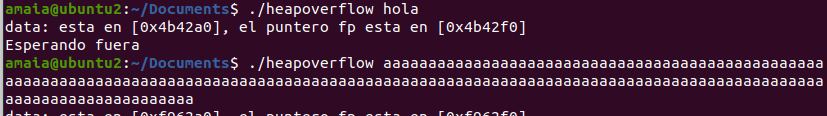
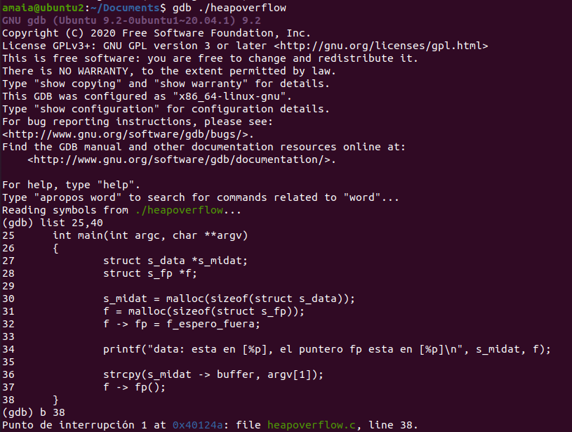
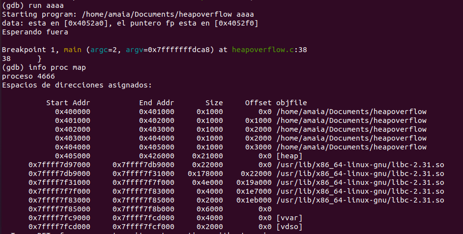
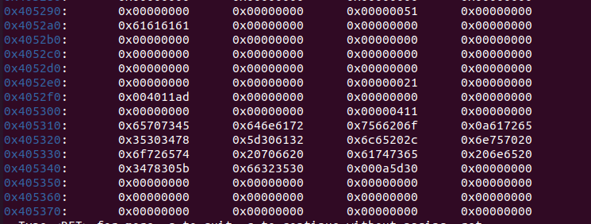
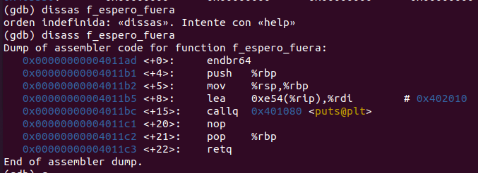
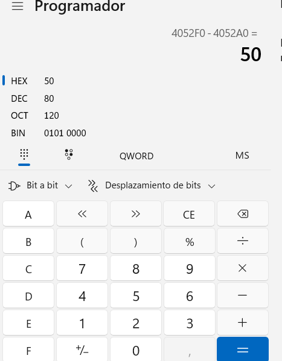
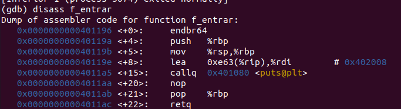
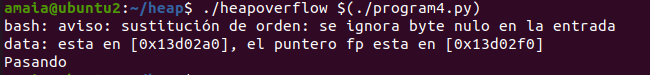

Amaia Echeandia
aechep00@estudiantes.unileon.es

El objetivo de esta práctica es realizar un heap overflow con el código de ejemplo que tenemos en el enunciado del ejercicio.
Similar a los buffer overflow, en este caso hablamos del heap, el cual hace reservas de memoria de manera dinámica utilizando, por ejemplo, la función malloc(). 
En nuestro código podemos encontrar dos funciones malloc(). 
La clave está en la función strcpy(), ya que este no verifica la longitud de la entrada del usuario, por lo que podría generar overflows al copiar la entrada del usuario al buffer.

Nuestro objetivo es que en vez de imprimirse 'Esperando fuera', la salida sea 'Pasando'.

Comenzaremos por compilar nuestro código sin las protecciones contra overflows con el siguiente comando:
```
gcc heapoverflow.c -w -g -no-pie -z execstack -o heapoverflow
```

Y si ejecutamos, dependiendo de la entrada, veremos que en el segundo caso detectará un error en el acceso a memoria:



Para comenzar con el análisis, haremos uso del depurador dbg y pondremos un breakpoint antes de terminar la ejecución del programa para examinar el comportamiento:



A continuación, pasaremos un argumento aleatorio, en este caso 'aaaa' = '0x61616161' mientras seguimos ejecutando e imprimimos los espacios de memoria para buscar donde se encuentra el heap:



La primera dirección del heap será 0x405000 hasta 0x426000, por lo tanto, imprimimos el contenido de él desde esa dirección con el comando:
```
(gdb) x/240x 0x405000
```


Pasando!!

Podemos identificar que a partir de la dirección 0x4052a0 se comienza a almacenar nuestro input -> '0x61616161'. Ahora buscaremos la dirección de la función 'f_espero_fuera' y comprobaremos con este valor en qué posición del heap se encuentra. Está dirección del heap nos servirá para saber hasta donde tendremos que rellenar el input de caracteres e introducir la dirección a la función que queremos que se ejecute, que en este caso será 'f_entrar'.



El comienzo de la función f_espero_fuera es '0x4011ad'. Si volvemos a la imagen del volcado del heap, veremos que esta dirección ya se encuentra en la dirección '0x4052f0'.
Conclusión, como ya hemos mencionado, tendremos que hacer un script que rellene los espacios entre la dirección '0x4052a0' (donde comienza el input) y '0x4052f0' (donde se encuentra la dirección de la función 'f_espero_fuera'). A partir de esta dirección, sobreescribiremos la dirección de la función 'f_entrar'.



La cantidad de bytes a rellenar serán 80 (0x50), que es la diferencia entre las dos direcciónes. 

Ahora veremos cuál es la dirección de la función 'f_entrar' que imprime 'Pasando':



Comienza en 0x401196 teniendo en cuenta el endian, nuestro script será el siguiente:
```
#!/usr/bin/python
print ('X' * 79 + "\x96\x11\x40\x00")
```

Pasando!!!
